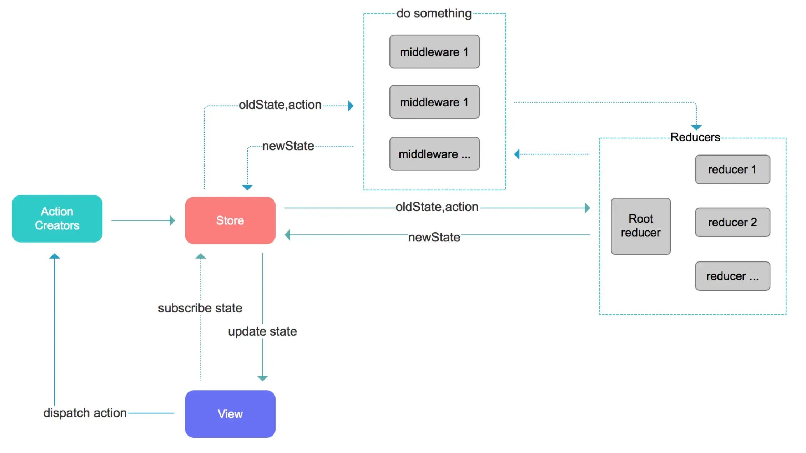

Redux 是一个 JavaScript 状态管理库，它可以帮助开发者更好地管理和控制应用的状态。在 Redux 中，所有的状态都被保存在一个单一的存储库中，这个存储库被称为 Store。Store 中的状态可以通过纯函数方式进行修改和更新，这样可以确保状态的变化不会引起副作用。

## 基本使用步骤

1. 安装和导入 Redux 库：可以通过 npm 或 yarn 来安装 Redux，然后在代码中导入相关模块。

```shell
npm init -y
npm i redux
```

2. 定义初始状态：通过创建一个状态对象来定义初始状态。

```js
// 定义state初始化数据，是一个普通的对象
const initialState = {
  name: 'kobe',
  age: 25
}
```

3. 定义 reducer：reducer 是一个纯函数，用于根据指定的操作返回新的状态值。

```js
function reducer(state = initialState, action) {
  switch (action.type) {
    case 'INCREMENT':
      return { count: state.age + 1 };
    case 'DECREMENT':
      return { count: state.age - 1 };
    default:
      return state;
  }
}
```

4. 创建 store：通过调用 createStore 函数，并传入 reducer 以及初始状态，来创建一个 store 对象。

```js
const {createStore} = require('redux')

const initialState = {
  name: 'kobe',
  age: 25
}

function reducer(state = initialState, action) {
  switch (action.type) {
    case 'INCREMENT':
      return { ...state, age: state.age + 1 };
    case 'DECREMENT':
      return { ...state, age: state.age - 1 };
    case 'CHANGE_NAME':
      return {...state, name: action.name}
    default:
      return state;
  }
}

const store = createStore(reducer)

// node 环境，导出 store
module.exports = store
```

5. 触发 action：通过调用 dispatch 方法来触发状态变化的动作。

```js
const store = require('./store')

// 监听 store 的变化，有变化就会触发回调
const unsubscribe = store.subscribe(() => {
  // 获取 store 最新的 state
  console.log(store.getState())
})


// 通过 dispatch 触发 action 改变 state
store.dispatch({type: 'INCREMENT'})

function change_name(name){
  return {type: 'CHANGE_NAME', name}
}
store.dispatch(change_name('lilei'))

// 取消订阅
unsubscribe()
```

## 优化代码结构

但是上面的代码逻辑比较分散，且不易于管理和扩展，所以一般实际项目管理 store 会拆分成4个文件，分别是：

```js title=constants.js
// action 和 reducer 函数中使用的 type 字符串常量是一致的，所以将常量抽取到一个独立的文件中

const INCREMENT = 'INCREMENT'
const CHANGE_NAME = 'CHANGE_NAME'

module.exports = {
  INCREMENT,
  CHANGE_NAME
}
```

```js title=actionCreators.js
// 将派发的 action 放到一个文件中，以便各个文件引入

const {INCREMENT, CHANGE_NAME} = require('./constants')

function increment() {
  return {type: INCREMENT}
}

function change_name(name) {
  return {type: CHANGE_NAME, name}
}

module.exports = {
  increment, 
  change_name
}
```

```js title=reducer.js
// 将 initialState 和 reducer 放到独立的文件中

const {INCREMENT, CHANGE_NAME} = require('./constants')

const initialState = {
  name: 'kobe',
  age: 25
}

function reducer(state = initialState, action) {
  switch (action.type) {
    case INCREMENT:
      return { ...state, age: state.age + 1 }
    case CHANGE_NAME:
      return {...state, name: action.name}
    default:
      return state;
  }
}

module.exports = reducer
```

```js title=index.js
// 创建和导出 store

const {createStore} = require('redux')
const reducer = require('./reducer')

const store = createStore(reducer)

module.exports = store
```

在其他文件中使用 store 的方式：

```js
const store = reuqire('./store')
const {increment, change_name} = require('./store/actionCreators')

store.dispatch(increment)
store.dispatch(change_name('lilei'))
```

## Redux 流程图



## Redux 三大原则

1. 单一数据源
   * **整个应用程序的 state 被存储在一棵 object tree 中，并且这个 object tree 只存储在一个 Store 中**；
   * Redux 并没有强制让我们不能创建多个 Store，但是那样不利于数据维护；
   * 单一数据源可以让整个应用程序的 state 变得方便维护、追踪、修改。

2. state 是只读的
   * **唯一修改 state 的方法一定是触发 action，不要试图在其他地方通过任何的方式修改 state**；
   * 这样就确保了 View 或者网络请求都不能直接修改 state，它们只能通过 action 来描述自己想要如何修改 state；
   * 也可以保证所有的修改都被集中化处理，并且按照严格的顺序来执行，不需要担心 race condition（竞态）问题。

3. 使用纯函数来修改
   * 通过 reducer 将旧的 state 和 action 联系在一起，并且返回一个新的 state；
   * 随着应用程序的复杂度增加，可以将 reducer 拆分成多个小的 reducer，分别操作不同 state tree 的一部分；
   * **所有的 reducer 都应该是纯函数，不能产生任何的副作用**。

## Node 中对 ES6 模块的支持

:::note 从 `Node v13.2.0` 开始，Node 才对 ES6 模块化提供支持

* `Node v13.2.0` 之前，需要进行如下操作：
  * 在 `package.json` 中添加属性：`"type": "module"`
  * 在执行命令中添加如下选项：`node --experimental-modules src/index.js`
* `Node v13.2.0` 之后，只需进行如下操作：
  * 在 `package.json` 中添加属性：`"type": "module"`

> 导入文件时，需要跟上 `.js` 后缀名

:::