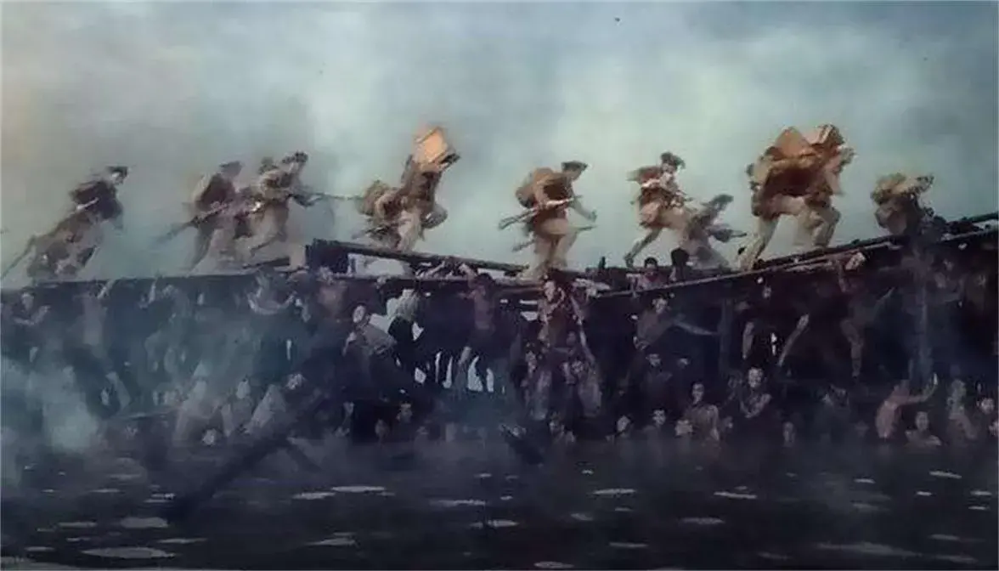

尽管有了看过《八佰》的经验，当《金刚川》第四幕“桥”的视角开始，当军人和工兵从身后冲出时，眼泪还是止不住地流了下来。

真的有这种为了战争胜利、为了民族荣誉、为了国家命运而以身许国的精神吗？我知道答案是肯定的。而正是这种精神，感动了我，更确切地说，震撼了我。我深深地体会到当时金刚川上先烈们极力想冲过桥抗美援朝打胜仗的豪情壮志。正是他们，用无量之鲜血，换我今日无量之中华。

也许真实的战场上，一次次战役的艰辛，一个个生命的消逝，没有电影中的渲染和煽情，但是通过电影，先烈们的故事将永远流动在银幕的光影里，永远鲜活在我们共同的国族记忆里。

